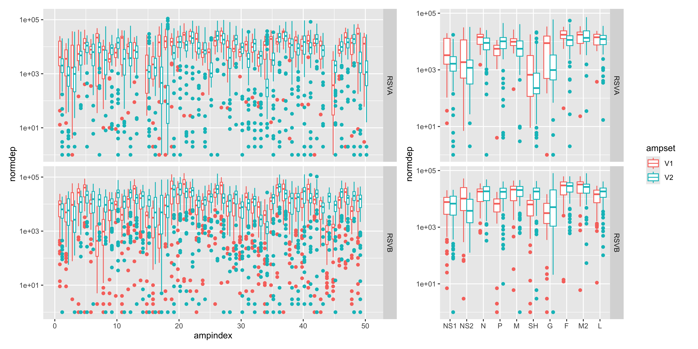
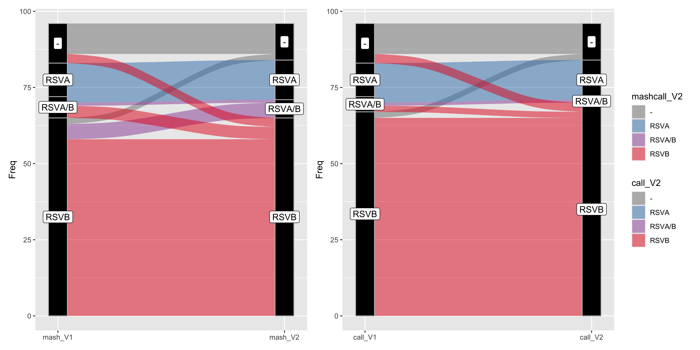
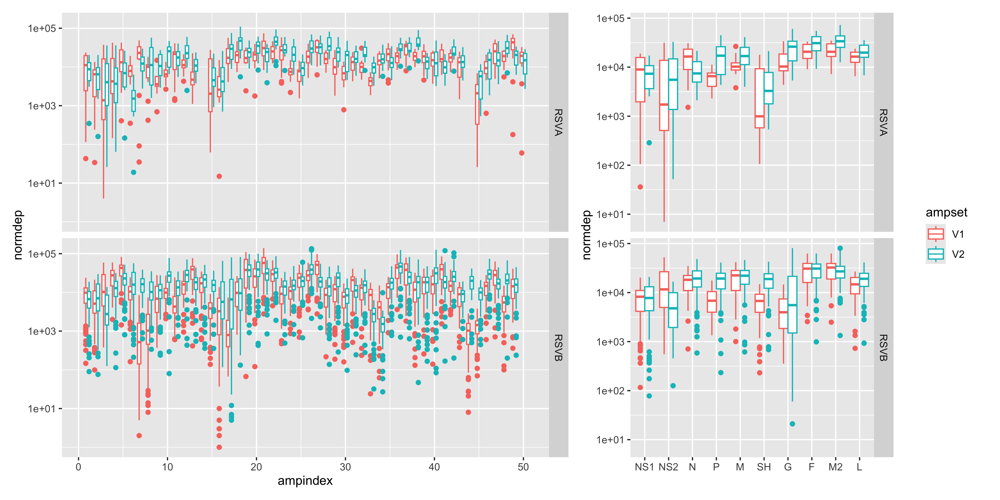
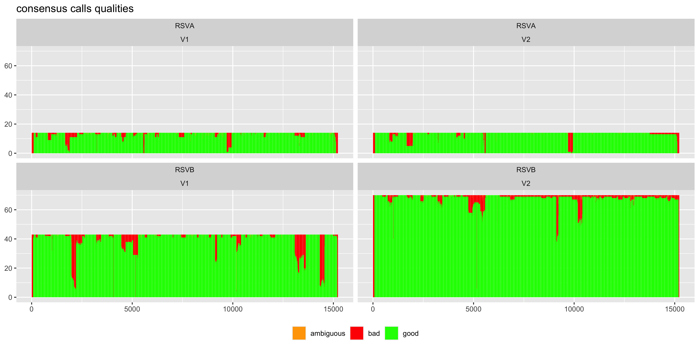
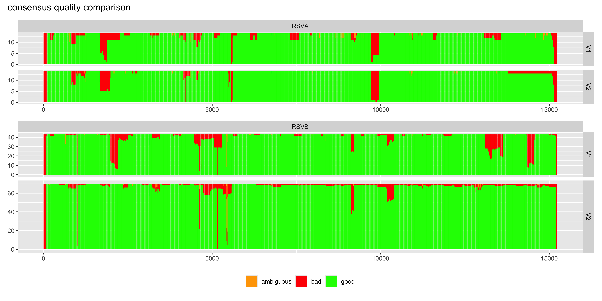

``` r
library(tidyverse)
library(dplyr)

library(ggalluvial)
library(patchwork)
knitr::opts_chunk$set(fig.width=12,fig.height=6,dpi=400)
```


``` r
#get amplicon depth / div tables

ampdep <- rbind(read.table("data/RSVA_ampdepth_V1.txt",sep="\t",header=T) %>%
                  mutate("ampset"="V1","target"="RSVA"),
                read.table("data/RSVA_ampdepth_v2.txt",sep="\t",header=T) %>%
                  mutate(sample = gsub("-1$","",sample)) %>%
                  mutate(ampset="V2","target"="RSVA"),
                read.table("data/RSVB_ampdepth_V1.txt",sep="\t",header=T) %>%
                  mutate("ampset"="V1","target"="RSVB"),
                read.table("data/RSVB_ampdepth_v2.txt",sep="\t",header=T) %>%
                  mutate(sample = gsub("-1$","",sample)) %>%
                  mutate(ampset="V2","target"="RSVB")) %>% 
             mutate(start=as.numeric(start),
                    end=as.numeric(end),
                    depth=as.numeric(depth),
                    sampleindex=as.numeric(gsub("Yale-RSV-","",sample)),
                    ampindex=as.numeric(gsub("Amplicon ","",name))
                    ) %>% 
             mutate("pos"=round((start+end)/2)) %>% 
            filter(sampleindex <= 96) 
```

```
## Warning: There were 5 warnings in `mutate()`.
## The first warning was:
## ℹ In argument: `start = as.numeric(start)`.
## Caused by warning:
## ! NAs introduced by coercion
## ℹ Run `dplyr::last_dplyr_warnings()` to see the 4 remaining warnings.
```

``` r
ampdiv <- rbind(read.table("data/RSVA_ampdiv_V1.txt",sep="\t",header=F,
                            col.names=c("start","end","name","file","pi")) %>%
                      mutate("ampset"="V1") %>%
                      mutate(file = gsub("results/ivar/","",file)) %>%
                      separate_wider_delim(file,delim="_",
                                           names = c("sample","target"),
                                           too_many = "drop"),
                read.table("data/RSVA_ampdiv_v2.txt",sep="\t",header=F,
                            col.names=c("start","end","name","file","pi")) %>%
                      mutate("ampset"="V2") %>%
                      mutate(file = gsub("results/ivar/","",file)) %>%
                      separate_wider_delim(file,delim="_",
                                           names = c("sample","target"),
                                           too_many = "drop"),
                read.table("data/RSVB_ampdiv_V2.txt",sep="\t",header=F,
                            col.names=c("start","end","name","file","pi")) %>%
                      mutate("ampset"="V2") %>%
                      mutate(file = gsub("results/ivar/","",file)) %>%
                      separate_wider_delim(file,delim="_",
                                           names = c("sample","target"),
                                           too_many = "drop"),
                read.table("data/RSVB_ampdiv_v2.txt",sep="\t",header=F,
                            col.names=c("start","end","name","file","pi")) %>%
                      mutate("ampset"="V2") %>%
                      mutate(file = gsub("results/ivar/","",file)) %>%
                      separate_wider_delim(file,delim="_",
                                           names = c("sample","target"),
                                           too_many = "drop")) %>% 
             mutate(start=as.numeric(start),
                    end=as.numeric(end),
                    pi=as.numeric(pi),
                    sampleindex=as.numeric(gsub("Yale-RSV-","",sample)),
                    ampindex=as.numeric(gsub("Amplicon ","",name))
                    ) %>% 
             mutate("pos"=round((start+end)/2)) %>% 
            filter(sampleindex <= 96) 
```

```
## Warning: There was 1 warning in `mutate()`.
## ℹ In argument: `sampleindex = as.numeric(gsub("Yale-RSV-", "", sample))`.
## Caused by warning:
## ! NAs introduced by coercion
```

``` r
#table(ampdep[,c("sample","target","ampset")])
#table(ampdiv[,c("sample","target","ampset")])

ampdep <- merge(ampdep,
                ampdep %>% dplyr::group_by(ampset) %>% 
                  summarize(meddep=median(depth))) %>% 
                mutate(normdep=round((depth/meddep)*10000))
```


``` r
#get genelicon depth / div tables

genedep <- rbind(read.table("data/RSVA_genedepth_V1.txt",sep="\t",header=T) %>%
                  mutate("ampset"="V1","target"="RSVA"),
                read.table("data/RSVA_genedepth_v2.txt",sep="\t",header=T) %>%
                  mutate(sample = gsub("-1$","",sample)) %>%
                  mutate(ampset="V2","target"="RSVA"),
                read.table("data/RSVB_genedepth_V1.txt",sep="\t",header=T) %>%
                  mutate("ampset"="V1","target"="RSVB"),
                read.table("data/RSVB_genedepth_v2.txt",sep="\t",header=T) %>%
                  mutate(sample = gsub("-1$","",sample)) %>%
                  mutate(ampset="V2","target"="RSVB")) %>% 
             mutate(start=as.numeric(start),
                    end=as.numeric(end),
                    depth=as.numeric(depth),
                    sampleindex=as.numeric(gsub("Yale-RSV-","",sample))
                    ) %>% 
             mutate("pos"=round((start+end)/2)) %>% 
            filter(sampleindex <= 96) 
```

```
## Warning: There were 4 warnings in `mutate()`.
## The first warning was:
## ℹ In argument: `start = as.numeric(start)`.
## Caused by warning:
## ! NAs introduced by coercion
## ℹ Run `dplyr::last_dplyr_warnings()` to see the 3 remaining warnings.
```

``` r
genediv <- rbind(read.table("data/RSVA_genediv_V1.txt",sep="\t",header=F,
                            col.names=c("start","end","name","file","pi")) %>%
                      mutate("ampset"="V1") %>%
                      mutate(file = gsub("results/ivar/","",file)) %>%
                      separate_wider_delim(file,delim="_",
                                           names = c("sample","target"),
                                           too_many = "drop"),
                read.table("data/RSVA_genediv_v2.txt",sep="\t",header=F,
                            col.names=c("start","end","name","file","pi")) %>%
                      mutate("ampset"="V2") %>%
                      mutate(file = gsub("results/ivar/","",file)) %>%
                      separate_wider_delim(file,delim="_",
                                           names = c("sample","target"),
                                           too_many = "drop"),
                read.table("data/RSVB_genediv_V1.txt",sep="\t",header=F,
                            col.names=c("start","end","name","file","pi")) %>%
                      mutate("ampset"="V1") %>%
                      mutate(file = gsub("results/ivar/","",file)) %>%
                      separate_wider_delim(file,delim="_",
                                           names = c("sample","target"),
                                           too_many = "drop"),
                read.table("data/RSVB_genediv_v2.txt",sep="\t",header=F,
                            col.names=c("start","end","name","file","pi")) %>%
                      mutate("ampset"="V2") %>%
                      mutate(file = gsub("results/ivar/","",file)) %>%
                      separate_wider_delim(file,delim="_",
                                           names = c("sample","target"),
                                           too_many = "drop")) %>% 
             mutate(start=as.numeric(start),
                    end=as.numeric(end),
                    pi=as.numeric(pi),
                    sampleindex=as.numeric(gsub("Yale-RSV-","",sample))
                    ) %>% 
             mutate("pos"=round((start+end)/2)) %>% 
            filter(sampleindex <= 96) 
```

```
## Warning: There was 1 warning in `mutate()`.
## ℹ In argument: `sampleindex = as.numeric(gsub("Yale-RSV-", "", sample))`.
## Caused by warning:
## ! NAs introduced by coercion
```

``` r
table(genedep[,c("sample","target","ampset")])
```

```
## , , ampset = V1
## 
##                target
## sample          RSVA RSVB
##   Yale-RSV-0001   10   10
##   Yale-RSV-0002   10   10
##   Yale-RSV-0003   10   10
##   Yale-RSV-0004    0   10
##   Yale-RSV-0005    0   10
##   Yale-RSV-0006   10   10
##   Yale-RSV-0007   10   10
##   Yale-RSV-0008   10   10
##   Yale-RSV-0009    0   10
##   Yale-RSV-0010    0   10
##   Yale-RSV-0011    0   10
##   Yale-RSV-0012    0   10
##   Yale-RSV-0013    0   10
##   Yale-RSV-0014    0   10
##   Yale-RSV-0015    0   10
##   Yale-RSV-0016    0   10
##   Yale-RSV-0017    0   10
##   Yale-RSV-0018    0   10
##   Yale-RSV-0019    0   10
##   Yale-RSV-0020   10    0
##   Yale-RSV-0021    0   10
##   Yale-RSV-0022    0   10
##   Yale-RSV-0023    0   10
##   Yale-RSV-0024    0   10
##   Yale-RSV-0025    0   10
##   Yale-RSV-0026   10   10
##   Yale-RSV-0027    0   10
##   Yale-RSV-0028    0   10
##   Yale-RSV-0029   10   10
##   Yale-RSV-0030   10    0
##   Yale-RSV-0031    0   10
##   Yale-RSV-0032    0    0
##   Yale-RSV-0033    0   10
##   Yale-RSV-0034    0   10
##   Yale-RSV-0035    0   10
##   Yale-RSV-0036    0   10
##   Yale-RSV-0037   10    0
##   Yale-RSV-0038    0   10
##   Yale-RSV-0039    0   10
##   Yale-RSV-0040    0   10
##   Yale-RSV-0041    0   10
##   Yale-RSV-0042    0   10
##   Yale-RSV-0043   10    0
##   Yale-RSV-0044   10   10
##   Yale-RSV-0045    0   10
##   Yale-RSV-0046    0    0
##   Yale-RSV-0047   10   10
##   Yale-RSV-0048    0   10
##   Yale-RSV-0049    0   10
##   Yale-RSV-0050    0   10
##   Yale-RSV-0051   10   10
##   Yale-RSV-0052    0   10
##   Yale-RSV-0053   10    0
##   Yale-RSV-0054    0   10
##   Yale-RSV-0055   10    0
##   Yale-RSV-0056    0   10
##   Yale-RSV-0057    0   10
##   Yale-RSV-0058    0   10
##   Yale-RSV-0059    0   10
##   Yale-RSV-0060    0   10
##   Yale-RSV-0061   10    0
##   Yale-RSV-0062    0    0
##   Yale-RSV-0063    0   10
##   Yale-RSV-0064    0   10
##   Yale-RSV-0065    0   10
##   Yale-RSV-0066    0   10
##   Yale-RSV-0067    0   10
##   Yale-RSV-0068    0   10
##   Yale-RSV-0069    0    0
##   Yale-RSV-0070   10   10
##   Yale-RSV-0071   10   10
##   Yale-RSV-0072    0   10
##   Yale-RSV-0073    0   10
##   Yale-RSV-0074    0   10
##   Yale-RSV-0075   10    0
##   Yale-RSV-0076   10    0
##   Yale-RSV-0077    0    0
##   Yale-RSV-0078    0    0
##   Yale-RSV-0079    0   10
##   Yale-RSV-0080    0   10
##   Yale-RSV-0081    0   10
##   Yale-RSV-0082    0   10
##   Yale-RSV-0083    0   10
##   Yale-RSV-0084    0   10
##   Yale-RSV-0085   10    0
##   Yale-RSV-0086    0   10
##   Yale-RSV-0087    0   10
##   Yale-RSV-0088   10    0
##   Yale-RSV-0089    0   10
##   Yale-RSV-0090    0   10
##   Yale-RSV-0091    0   10
##   Yale-RSV-0092    0   10
##   Yale-RSV-0093    0   10
##   Yale-RSV-0094    0   10
##   Yale-RSV-0095    0   10
##   Yale-RSV-0096    0   10
## 
## , , ampset = V2
## 
##                target
## sample          RSVA RSVB
##   Yale-RSV-0001   10    0
##   Yale-RSV-0002   10   10
##   Yale-RSV-0003   10   10
##   Yale-RSV-0004   10   10
##   Yale-RSV-0005   10   10
##   Yale-RSV-0006   10    0
##   Yale-RSV-0007   10    0
##   Yale-RSV-0008   10   10
##   Yale-RSV-0009   10   10
##   Yale-RSV-0010    0    0
##   Yale-RSV-0011   10   10
##   Yale-RSV-0012   10   10
##   Yale-RSV-0013   10   10
##   Yale-RSV-0014   10   10
##   Yale-RSV-0015   10   10
##   Yale-RSV-0016    0   10
##   Yale-RSV-0017   10   10
##   Yale-RSV-0018   10   10
##   Yale-RSV-0019   10   10
##   Yale-RSV-0020   10   10
##   Yale-RSV-0021   10   10
##   Yale-RSV-0022   10   10
##   Yale-RSV-0023    0   10
##   Yale-RSV-0024    0   10
##   Yale-RSV-0025   10   10
##   Yale-RSV-0026   10   10
##   Yale-RSV-0027   10   10
##   Yale-RSV-0028   10   10
##   Yale-RSV-0029    0   10
##   Yale-RSV-0030   10    0
##   Yale-RSV-0031   10   10
##   Yale-RSV-0032    0   10
##   Yale-RSV-0033   10   10
##   Yale-RSV-0034    0   10
##   Yale-RSV-0035    0   10
##   Yale-RSV-0036    0   10
##   Yale-RSV-0037   10    0
##   Yale-RSV-0038   10   10
##   Yale-RSV-0039   10   10
##   Yale-RSV-0040   10   10
##   Yale-RSV-0041    0   10
##   Yale-RSV-0042   10   10
##   Yale-RSV-0043   10    0
##   Yale-RSV-0044   10   10
##   Yale-RSV-0045   10   10
##   Yale-RSV-0046    0   10
##   Yale-RSV-0047   10   10
##   Yale-RSV-0048   10   10
##   Yale-RSV-0049   10   10
##   Yale-RSV-0050    0   10
##   Yale-RSV-0051   10   10
##   Yale-RSV-0052   10   10
##   Yale-RSV-0053   10    0
##   Yale-RSV-0054   10   10
##   Yale-RSV-0055   10    0
##   Yale-RSV-0056    0   10
##   Yale-RSV-0057   10   10
##   Yale-RSV-0058   10   10
##   Yale-RSV-0059    0   10
##   Yale-RSV-0060   10   10
##   Yale-RSV-0061   10    0
##   Yale-RSV-0062   10   10
##   Yale-RSV-0063   10   10
##   Yale-RSV-0064    0   10
##   Yale-RSV-0065   10   10
##   Yale-RSV-0066   10   10
##   Yale-RSV-0067   10   10
##   Yale-RSV-0068    0   10
##   Yale-RSV-0069    0   10
##   Yale-RSV-0070   10   10
##   Yale-RSV-0071   10   10
##   Yale-RSV-0072   10   10
##   Yale-RSV-0073    0   10
##   Yale-RSV-0074    0   10
##   Yale-RSV-0075   10    0
##   Yale-RSV-0076   10    0
##   Yale-RSV-0077    0   10
##   Yale-RSV-0078   10    0
##   Yale-RSV-0079    0   10
##   Yale-RSV-0080   10   10
##   Yale-RSV-0081   10   10
##   Yale-RSV-0082   10   10
##   Yale-RSV-0083   10   10
##   Yale-RSV-0084   10   10
##   Yale-RSV-0085   10    0
##   Yale-RSV-0086   10   10
##   Yale-RSV-0087   10   10
##   Yale-RSV-0088   10    0
##   Yale-RSV-0089    0   10
##   Yale-RSV-0090    0   10
##   Yale-RSV-0091    0   10
##   Yale-RSV-0092   10   10
##   Yale-RSV-0093   10   10
##   Yale-RSV-0094   10   10
##   Yale-RSV-0095   10    0
##   Yale-RSV-0096   10    0
```

``` r
table(genediv[,c("sample","target","ampset")])
```

```
## , , ampset = V1
## 
##                target
## sample          RSVA RSVB
##   Yale-RSV-0001   10   10
##   Yale-RSV-0002   10   10
##   Yale-RSV-0003   10   10
##   Yale-RSV-0004    0   10
##   Yale-RSV-0005    0   10
##   Yale-RSV-0006   10   10
##   Yale-RSV-0007   10   10
##   Yale-RSV-0008   10   10
##   Yale-RSV-0009    0   10
##   Yale-RSV-0010    0   10
##   Yale-RSV-0011    0   10
##   Yale-RSV-0012    0   10
##   Yale-RSV-0013    0   10
##   Yale-RSV-0014    0   10
##   Yale-RSV-0015    0   10
##   Yale-RSV-0016    0   10
##   Yale-RSV-0017    0   10
##   Yale-RSV-0018    0   10
##   Yale-RSV-0019    0   10
##   Yale-RSV-0020   10    0
##   Yale-RSV-0021    0   10
##   Yale-RSV-0022    0   10
##   Yale-RSV-0023    0   10
##   Yale-RSV-0024    0   10
##   Yale-RSV-0025    0   10
##   Yale-RSV-0026   10   10
##   Yale-RSV-0027    0   10
##   Yale-RSV-0028    0   10
##   Yale-RSV-0029   10   10
##   Yale-RSV-0030   10    0
##   Yale-RSV-0031    0   10
##   Yale-RSV-0033    0   10
##   Yale-RSV-0034    0   10
##   Yale-RSV-0035    0   10
##   Yale-RSV-0036    0   10
##   Yale-RSV-0037   10    0
##   Yale-RSV-0038    0   10
##   Yale-RSV-0039    0   10
##   Yale-RSV-0040    0   10
##   Yale-RSV-0041    0   10
##   Yale-RSV-0042    0   10
##   Yale-RSV-0043   10    0
##   Yale-RSV-0044   10   10
##   Yale-RSV-0045    0   10
##   Yale-RSV-0047   10   10
##   Yale-RSV-0048    0   10
##   Yale-RSV-0049    0   10
##   Yale-RSV-0050    0   10
##   Yale-RSV-0051   10   10
##   Yale-RSV-0052    0   10
##   Yale-RSV-0053   10    0
##   Yale-RSV-0054    0   10
##   Yale-RSV-0055   10    0
##   Yale-RSV-0056    0   10
##   Yale-RSV-0057    0   10
##   Yale-RSV-0058    0   10
##   Yale-RSV-0059    0   10
##   Yale-RSV-0060    0   10
##   Yale-RSV-0061   10    0
##   Yale-RSV-0063    0   10
##   Yale-RSV-0064    0   10
##   Yale-RSV-0065    0   10
##   Yale-RSV-0066    0   10
##   Yale-RSV-0067    0   10
##   Yale-RSV-0068    0   10
##   Yale-RSV-0070   10   10
##   Yale-RSV-0071   10   10
##   Yale-RSV-0072    0   10
##   Yale-RSV-0073    0   10
##   Yale-RSV-0074    0   10
##   Yale-RSV-0075   10    0
##   Yale-RSV-0076   10    0
##   Yale-RSV-0079    0   10
##   Yale-RSV-0080    0   10
##   Yale-RSV-0081    0   10
##   Yale-RSV-0082    0   10
##   Yale-RSV-0083    0   10
##   Yale-RSV-0084    0   10
##   Yale-RSV-0085   10    0
##   Yale-RSV-0086    0   10
##   Yale-RSV-0087    0   10
##   Yale-RSV-0088   10    0
##   Yale-RSV-0089    0   10
##   Yale-RSV-0090    0   10
##   Yale-RSV-0091    0   10
##   Yale-RSV-0092    0   10
##   Yale-RSV-0093    0   10
##   Yale-RSV-0094    0   10
##   Yale-RSV-0095    0   10
##   Yale-RSV-0096    0   10
```

``` r
genedep <- merge(genedep,
                genedep %>% dplyr::group_by(ampset) %>% 
                  summarize(meddep=median(depth))) %>% 
                mutate(normdep=round((depth/meddep)*10000))

genedep$gindex <- as.numeric(as.factor(genedep$pos))
genedep$name <- as.factor(gsub(" ","",gsub("gene","",genedep$name)))


geneorder <- c("NS1","NS2","N","P","M","SH","G","F","M2","L")
genedep$name <- factor(genedep$name,levels=geneorder,ordered=T)
genediv$name <- factor(genediv$name,levels=geneorder,ordered=T)
```


``` r
ampdepp <- ggplot(ampdep,aes(x=ampindex,y=normdep,group=paste(ampset,name,target),color=ampset)) +   
            geom_boxplot(position="dodge") + facet_grid(target ~ .) + scale_y_log10()

genedepp <- ggplot(genedep,aes(x=name,y=normdep,group=paste(ampset,name,target),color=ampset)) +   
            geom_boxplot(position="dodge") + facet_grid(target ~ .) + scale_y_log10() +
  theme(axis.title.x=element_blank())


ampdepp + genedepp + guide_area() + plot_layout(guides="collect",widths=c(6,3,1))
```

```
## Warning in transformation$transform(x): NaNs produced
```

```
## Warning in scale_y_log10(): log-10 transformation introduced infinite values.
```

```
## Warning: Removed 529 rows containing non-finite outside the scale range (`stat_boxplot()`).
```

```
## Warning in scale_y_log10(): log-10 transformation introduced infinite values.
```

```
## Warning: Removed 24 rows containing non-finite outside the scale range (`stat_boxplot()`).
```



``` r
# ggplot(unique(genedep[genedep$normdep > 100,c("ampset","name","sample","target")]),
#        aes(x=name,group=paste(ampset,name,target),fill=ampset)) +   
#             geom_bar(position="dodge") + facet_grid(target ~ .) +
#   theme(axis.title.x=element_blank())
```


``` r
#get final calls, filter out only good calls...

calls <- rbind(read.table("data/final_calls_V1.txt",sep="\t",header=T) %>% 
                 mutate(ampset="V1"),
              read.table("data/final_calls_v2.txt",sep="\t",header=T) %>% 
                mutate(ampset="V2")) %>%
          mutate(sample=gsub("-1","",sample)) %>% 
          mutate(sampleindex=as.numeric(gsub("Yale-RSV-","",sample))) %>% 
          filter(sampleindex <= 96) 

calls$mashcall[calls$mashcall==""] <- "RSVA/B"
calls$call[calls$call==""] <- calls$mashcall[calls$call==""]

calls
```

```
##            sample   call mashcall ampset sampleindex
## 1   Yale-RSV-0003   RSVB   RSVA/B     V1           3
## 2   Yale-RSV-0047   RSVB   RSVA/B     V1          47
## 3   Yale-RSV-0002 RSVA/B   RSVA/B     V1           2
## 4   Yale-RSV-0006 RSVA/B   RSVA/B     V1           6
## 5   Yale-RSV-0007 RSVA/B   RSVA/B     V1           7
## 6   Yale-RSV-0008 RSVA/B   RSVA/B     V1           8
## 7   Yale-RSV-0026 RSVA/B   RSVA/B     V1          26
## 8   Yale-RSV-0001   RSVA     RSVA     V1           1
## 9   Yale-RSV-0020   RSVA     RSVA     V1          20
## 10  Yale-RSV-0030   RSVA     RSVA     V1          30
## 11  Yale-RSV-0037   RSVA     RSVA     V1          37
## 12  Yale-RSV-0043   RSVA     RSVA     V1          43
## 13  Yale-RSV-0053   RSVA     RSVA     V1          53
## 14  Yale-RSV-0055   RSVA     RSVA     V1          55
## 15  Yale-RSV-0061   RSVA     RSVA     V1          61
## 16  Yale-RSV-0075   RSVA     RSVA     V1          75
## 17  Yale-RSV-0076   RSVA     RSVA     V1          76
## 18  Yale-RSV-0085   RSVA     RSVA     V1          85
## 19  Yale-RSV-0004   RSVB     RSVB     V1           4
## 20  Yale-RSV-0005   RSVB     RSVB     V1           5
## 21  Yale-RSV-0009   RSVB     RSVB     V1           9
## 22  Yale-RSV-0011   RSVB     RSVB     V1          11
## 23  Yale-RSV-0012   RSVB     RSVB     V1          12
## 24  Yale-RSV-0013   RSVB     RSVB     V1          13
## 25  Yale-RSV-0014   RSVB     RSVB     V1          14
## 26  Yale-RSV-0015   RSVB     RSVB     V1          15
## 27  Yale-RSV-0016   RSVB     RSVB     V1          16
## 28  Yale-RSV-0017   RSVB     RSVB     V1          17
## 29  Yale-RSV-0018   RSVB     RSVB     V1          18
## 30  Yale-RSV-0022   RSVB     RSVB     V1          22
## 31  Yale-RSV-0023   RSVB     RSVB     V1          23
## 32  Yale-RSV-0024   RSVB     RSVB     V1          24
## 33  Yale-RSV-0025   RSVB     RSVB     V1          25
## 34  Yale-RSV-0027   RSVB     RSVB     V1          27
## 35  Yale-RSV-0028   RSVB     RSVB     V1          28
## 36  Yale-RSV-0029   RSVB     RSVB     V1          29
## 37  Yale-RSV-0031   RSVB     RSVB     V1          31
## 38  Yale-RSV-0033   RSVB     RSVB     V1          33
## 39  Yale-RSV-0034   RSVB     RSVB     V1          34
## 40  Yale-RSV-0035   RSVB     RSVB     V1          35
## 41  Yale-RSV-0036   RSVB     RSVB     V1          36
## 42  Yale-RSV-0038   RSVB     RSVB     V1          38
## 43  Yale-RSV-0039   RSVB     RSVB     V1          39
## 44  Yale-RSV-0040   RSVB     RSVB     V1          40
## 45  Yale-RSV-0041   RSVB     RSVB     V1          41
## 46  Yale-RSV-0042   RSVB     RSVB     V1          42
## 47  Yale-RSV-0044   RSVB     RSVB     V1          44
## 48  Yale-RSV-0045   RSVB     RSVB     V1          45
## 49  Yale-RSV-0048   RSVB     RSVB     V1          48
## 50  Yale-RSV-0049   RSVB     RSVB     V1          49
## 51  Yale-RSV-0051   RSVB     RSVB     V1          51
## 52  Yale-RSV-0052   RSVB     RSVB     V1          52
## 53  Yale-RSV-0054   RSVB     RSVB     V1          54
## 54  Yale-RSV-0056   RSVB     RSVB     V1          56
## 55  Yale-RSV-0057   RSVB     RSVB     V1          57
## 56  Yale-RSV-0058   RSVB     RSVB     V1          58
## 57  Yale-RSV-0059   RSVB     RSVB     V1          59
## 58  Yale-RSV-0060   RSVB     RSVB     V1          60
## 59  Yale-RSV-0063   RSVB     RSVB     V1          63
## 60  Yale-RSV-0064   RSVB     RSVB     V1          64
## 61  Yale-RSV-0065   RSVB     RSVB     V1          65
## 62  Yale-RSV-0066   RSVB     RSVB     V1          66
## 63  Yale-RSV-0067   RSVB     RSVB     V1          67
## 64  Yale-RSV-0068   RSVB     RSVB     V1          68
## 65  Yale-RSV-0070   RSVB     RSVB     V1          70
## 66  Yale-RSV-0071   RSVB     RSVB     V1          71
## 67  Yale-RSV-0073   RSVB     RSVB     V1          73
## 68  Yale-RSV-0074   RSVB     RSVB     V1          74
## 69  Yale-RSV-0079   RSVB     RSVB     V1          79
## 70  Yale-RSV-0080   RSVB     RSVB     V1          80
## 71  Yale-RSV-0081   RSVB     RSVB     V1          81
## 72  Yale-RSV-0082   RSVB     RSVB     V1          82
## 73  Yale-RSV-0083   RSVB     RSVB     V1          83
## 74  Yale-RSV-0084   RSVB     RSVB     V1          84
## 75  Yale-RSV-0086   RSVB     RSVB     V1          86
## 76  Yale-RSV-0087   RSVB     RSVB     V1          87
## 77  Yale-RSV-0089   RSVB     RSVB     V1          89
## 78  Yale-RSV-0090   RSVB     RSVB     V1          90
## 79  Yale-RSV-0091   RSVB     RSVB     V1          91
## 80  Yale-RSV-0092   RSVB     RSVB     V1          92
## 81  Yale-RSV-0094   RSVB     RSVB     V1          94
## 82  Yale-RSV-0095   RSVB     RSVB     V1          95
## 83  Yale-RSV-0096   RSVB     RSVB     V1          96
## 84  Yale-RSV-0009   RSVB   RSVA/B     V2           9
## 85  Yale-RSV-0017   RSVB   RSVA/B     V2          17
## 86  Yale-RSV-0038   RSVB   RSVA/B     V2          38
## 87  Yale-RSV-0044   RSVB   RSVA/B     V2          44
## 88  Yale-RSV-0087   RSVB   RSVA/B     V2          87
## 89  Yale-RSV-0026 RSVA/B   RSVA/B     V2          26
## 90  Yale-RSV-0001   RSVA     RSVA     V2           1
## 91  Yale-RSV-0006   RSVA     RSVA     V2           6
## 92  Yale-RSV-0007   RSVA     RSVA     V2           7
## 93  Yale-RSV-0020   RSVA     RSVA     V2          20
## 94  Yale-RSV-0030   RSVA     RSVA     V2          30
## 95  Yale-RSV-0037   RSVA     RSVA     V2          37
## 96  Yale-RSV-0043   RSVA     RSVA     V2          43
## 97  Yale-RSV-0053   RSVA     RSVA     V2          53
## 98  Yale-RSV-0055   RSVA     RSVA     V2          55
## 99  Yale-RSV-0061   RSVA     RSVA     V2          61
## 100 Yale-RSV-0075   RSVA     RSVA     V2          75
## 101 Yale-RSV-0076   RSVA     RSVA     V2          76
## 102 Yale-RSV-0085   RSVA     RSVA     V2          85
## 103 Yale-RSV-0002   RSVB     RSVB     V2           2
## 104 Yale-RSV-0003   RSVB     RSVB     V2           3
## 105 Yale-RSV-0004   RSVB     RSVB     V2           4
## 106 Yale-RSV-0005   RSVB     RSVB     V2           5
## 107 Yale-RSV-0008   RSVB     RSVB     V2           8
## 108 Yale-RSV-0011   RSVB     RSVB     V2          11
## 109 Yale-RSV-0012   RSVB     RSVB     V2          12
## 110 Yale-RSV-0013   RSVB     RSVB     V2          13
## 111 Yale-RSV-0014   RSVB     RSVB     V2          14
## 112 Yale-RSV-0015   RSVB     RSVB     V2          15
## 113 Yale-RSV-0016   RSVB     RSVB     V2          16
## 114 Yale-RSV-0018   RSVB     RSVB     V2          18
## 115 Yale-RSV-0022   RSVB     RSVB     V2          22
## 116 Yale-RSV-0023   RSVB     RSVB     V2          23
## 117 Yale-RSV-0024   RSVB     RSVB     V2          24
## 118 Yale-RSV-0025   RSVB     RSVB     V2          25
## 119 Yale-RSV-0027   RSVB     RSVB     V2          27
## 120 Yale-RSV-0028   RSVB     RSVB     V2          28
## 121 Yale-RSV-0029   RSVB     RSVB     V2          29
## 122 Yale-RSV-0031   RSVB     RSVB     V2          31
## 123 Yale-RSV-0033   RSVB     RSVB     V2          33
## 124 Yale-RSV-0034   RSVB     RSVB     V2          34
## 125 Yale-RSV-0035   RSVB     RSVB     V2          35
## 126 Yale-RSV-0036   RSVB     RSVB     V2          36
## 127 Yale-RSV-0039   RSVB     RSVB     V2          39
## 128 Yale-RSV-0040   RSVB     RSVB     V2          40
## 129 Yale-RSV-0041   RSVB     RSVB     V2          41
## 130 Yale-RSV-0042   RSVB     RSVB     V2          42
## 131 Yale-RSV-0045   RSVB     RSVB     V2          45
## 132 Yale-RSV-0047   RSVB     RSVB     V2          47
## 133 Yale-RSV-0048   RSVB     RSVB     V2          48
## 134 Yale-RSV-0049   RSVB     RSVB     V2          49
## 135 Yale-RSV-0051   RSVB     RSVB     V2          51
## 136 Yale-RSV-0052   RSVB     RSVB     V2          52
## 137 Yale-RSV-0054   RSVB     RSVB     V2          54
## 138 Yale-RSV-0056   RSVB     RSVB     V2          56
## 139 Yale-RSV-0057   RSVB     RSVB     V2          57
## 140 Yale-RSV-0058   RSVB     RSVB     V2          58
## 141 Yale-RSV-0059   RSVB     RSVB     V2          59
## 142 Yale-RSV-0060   RSVB     RSVB     V2          60
## 143 Yale-RSV-0063   RSVB     RSVB     V2          63
## 144 Yale-RSV-0064   RSVB     RSVB     V2          64
## 145 Yale-RSV-0065   RSVB     RSVB     V2          65
## 146 Yale-RSV-0066   RSVB     RSVB     V2          66
## 147 Yale-RSV-0067   RSVB     RSVB     V2          67
## 148 Yale-RSV-0068   RSVB     RSVB     V2          68
## 149 Yale-RSV-0069   RSVB     RSVB     V2          69
## 150 Yale-RSV-0070   RSVB     RSVB     V2          70
## 151 Yale-RSV-0071   RSVB     RSVB     V2          71
## 152 Yale-RSV-0073   RSVB     RSVB     V2          73
## 153 Yale-RSV-0074   RSVB     RSVB     V2          74
## 154 Yale-RSV-0077   RSVB     RSVB     V2          77
## 155 Yale-RSV-0079   RSVB     RSVB     V2          79
## 156 Yale-RSV-0080   RSVB     RSVB     V2          80
## 157 Yale-RSV-0081   RSVB     RSVB     V2          81
## 158 Yale-RSV-0082   RSVB     RSVB     V2          82
## 159 Yale-RSV-0083   RSVB     RSVB     V2          83
## 160 Yale-RSV-0084   RSVB     RSVB     V2          84
## 161 Yale-RSV-0086   RSVB     RSVB     V2          86
## 162 Yale-RSV-0089   RSVB     RSVB     V2          89
## 163 Yale-RSV-0090   RSVB     RSVB     V2          90
## 164 Yale-RSV-0091   RSVB     RSVB     V2          91
## 165 Yale-RSV-0092   RSVB     RSVB     V2          92
## 166 Yale-RSV-0093   RSVB     RSVB     V2          93
## 167 Yale-RSV-0094   RSVB     RSVB     V2          94
```

``` r
#calls$change <- paste(calls$mashcall,">",calls$call)
```


``` r
calls$sampleindex
```

```
##   [1]  3 47  2  6  7  8 26  1 20 30 37 43 53 55 61 75 76 85  4  5  9 11 12 13 14 15 16 17 18 22
##  [31] 23 24 25 27 28 29 31 33 34 35 36 38 39 40 41 42 44 45 48 49 51 52 54 56 57 58 59 60 63 64
##  [61] 65 66 67 68 70 71 73 74 79 80 81 82 83 84 86 87 89 90 91 92 94 95 96  9 17 38 44 87 26  1
##  [91]  6  7 20 30 37 43 53 55 61 75 76 85  2  3  4  5  8 11 12 13 14 15 16 18 22 23 24 25 27 28
## [121] 29 31 33 34 35 36 39 40 41 42 45 47 48 49 51 52 54 56 57 58 59 60 63 64 65 66 67 68 69 70
## [151] 71 73 74 77 79 80 81 82 83 84 86 89 90 91 92 93 94
```

``` r
nchanges <- calls %>% pivot_wider(names_from=ampset,values_from=c(call,mashcall)) %>%   
                      replace_na(list(call_V1="-",call_V2="-",
                                      mashcall_V1="-",mashcall_V2="-")) %>% 
                      arrange(sampleindex) %>% 
                      group_by(mashcall_V1,call_V1,mashcall_V2,call_V2) %>%
                      summarize(Freq=n())
```

```
## `summarise()` has grouped output by 'mashcall_V1', 'call_V1', 'mashcall_V2'. You can override
## using the `.groups` argument.
```

``` r
i <- nrow(nchanges)+1
nchanges[i,c(1:4)] <- "-"
nchanges[i,5] <- sum(!c(1:96) %in% calls$sampleindex)


fillcalls =   scale_fill_manual(values=c("RSVB"="#e41a1c","RSVA"="#377eb8",
                                         "RSVA/B"="#984ea3","-"="grey50"))

allchangesp <- ggplot(nchanges,
       aes(y = Freq, axis1 = mashcall_V2,axis2 = call_V2,
                     axis3 = mashcall_V2,axis4 = call_V2,)) +
  geom_alluvium(aes(fill = call_V2), width = 1/12) +
  geom_stratum(width = 1/12, fill = "black", color = "grey") +
  geom_label(stat = "stratum", aes(label = after_stat(stratum))) +
  scale_x_discrete(limits = c("mash1", "call1","mash2","call2"), expand = c(.05, .05)) +
  fillcalls

chg1p <- ggplot(nchanges,
       aes(y = Freq, axis1 = mashcall_V1,axis2 = call_V1)) +
  geom_alluvium(aes(fill = call_V1), width = 1/12) +
  geom_stratum(width = 1/12, fill = "black", color = "grey") +
  geom_label(stat = "stratum", aes(label = after_stat(stratum))) +
  scale_x_discrete(limits = c("mash_v1", "call_v1"), expand = c(.05, .05)) +
  fillcalls

chg2p <- ggplot(nchanges,
       aes(y = Freq, axis1 = mashcall_V2,axis2 = call_V2)) +
  geom_alluvium(aes(fill = call_V2), width = 1/12) +
  geom_stratum(width = 1/12, fill = "black", color = "grey") +
  geom_label(stat = "stratum", aes(label = after_stat(stratum))) +
  scale_x_discrete(limits = c("mash_v2", "call_v2"), expand = c(.05, .05)) +
  fillcalls

#chg1p + chg2p + guide_area() + plot_layout(guides="collect",widths=c(4,4,1))

callp <- ggplot(nchanges,
       aes(y = Freq, axis1 = mashcall_V1,axis2 = mashcall_V2)) +
  geom_alluvium(aes(fill = mashcall_V2), width = 1/12) +
  geom_stratum(width = 1/12, fill = "black", color = "grey") +
  geom_label(stat = "stratum", aes(label = after_stat(stratum))) +
  scale_x_discrete(limits = c("mash_V2", "mash_v2"), expand = c(.05, .05)) +
  fillcalls

mashp <- ggplot(nchanges,
       aes(y = Freq, axis1 = call_V1,axis2 = call_V2)) +
  geom_alluvium(aes(fill = call_V2), width = 1/12) +
  geom_stratum(width = 1/12, fill = "black", color = "grey") +
  geom_label(stat = "stratum", aes(label = after_stat(stratum))) +
  scale_x_discrete(limits = c("call_V2", "call_v2"), expand = c(.05, .05)) +
  fillcalls

callp + mashp + guide_area() + plot_layout(guides="collect",widths=c(4,4,1))
```

```
## Warning in to_lodes_form(data = data, axes = axis_ind, discern = params$discern): Some strata
## appear at multiple axes.
## Warning in to_lodes_form(data = data, axes = axis_ind, discern = params$discern): Some strata
## appear at multiple axes.
## Warning in to_lodes_form(data = data, axes = axis_ind, discern = params$discern): Some strata
## appear at multiple axes.
## Warning in to_lodes_form(data = data, axes = axis_ind, discern = params$discern): Some strata
## appear at multiple axes.
## Warning in to_lodes_form(data = data, axes = axis_ind, discern = params$discern): Some strata
## appear at multiple axes.
## Warning in to_lodes_form(data = data, axes = axis_ind, discern = params$discern): Some strata
## appear at multiple axes.
```




``` r
#get correct (V2) calls, split out RSVA/B into individual calls
rightcalls <- calls[calls$ampset=="V2",c("sample","call")]
abcalls <- rightcalls$sample[rightcalls$call=="RSVA/B"]
rightcalls <- rbind(rightcalls[!rightcalls$sample %in% abcalls,],
                  data.frame("sample"=rep(abcalls,each=2),
                             "call"=rep(c("RSVA","RSVB"),length(abcalls)))
                  )
colnames(rightcalls) <- c("sample","target")

genedepT <- merge(genedep,rightcalls)
ampdepT <- merge(ampdep,rightcalls)

ampdepTp <- ggplot(ampdepT,aes(x=ampindex,y=normdep,group=paste(ampset,name,target),color=ampset)) +   
            geom_boxplot(position="dodge") + facet_grid(target ~ .) + scale_y_log10()

genedepTp <- ggplot(genedepT,aes(x=name,y=normdep,group=paste(ampset,name,target),color=ampset)) +   
            geom_boxplot(position="dodge") + facet_grid(target ~ .) + scale_y_log10() +
  theme(axis.title.x=element_blank())

ampdepTp + genedepTp + guide_area() + plot_layout(guides="collect",widths=c(6,3,1))
```

```
## Warning in transformation$transform(x): NaNs produced
```

```
## Warning in scale_y_log10(): log-10 transformation introduced infinite values.
```

```
## Warning: Removed 202 rows containing non-finite outside the scale range (`stat_boxplot()`).
```



``` r
# ggplot(unique(genedepT[genedepT$normdep > 1000,c("ampset","name","sample","target")]),
#        aes(x=name,group=paste(ampset,name,target),fill=ampset)) +   
#             geom_bar(position="dodge") + facet_grid(target ~ .) +
#   theme(axis.title.x=element_blank())
```


``` r
consquals <- rbind(read.table("RSVA_all_aligned_qual_v1.txt",sep="\t",header=T) %>% 
                        mutate(ampset="V1",target="RSVA"),
                  read.table("RSVB_all_aligned_qual_v1.txt",sep="\t",header=T) %>% 
                        mutate(ampset="V1",target="RSVB"),
                  read.table("RSVA_all_aligned_qual_v2.txt",sep="\t",header=T) %>% 
                        mutate(ampset="V2",target="RSVA"),
                  read.table("RSVB_all_aligned_qual_v2.txt",sep="\t",header=T) %>% 
                        mutate(ampset="V2",target="RSVB")) %>% 
              pivot_longer(cols=c("good","ambiguous","bad"))
```


``` r
qplot = ggplot(consquals, aes(x=pos,y=value,fill=name)) +
            geom_bar(stat="identity",color=NA) +
            scale_fill_manual(values=c("good"="green",
                                      "ambiguous"="orange",
                                      "bad"="red"),
                             name="") +
            ggtitle("consensus calls qualities") +
            facet_wrap(vars(target,ampset)) +
            theme(legend.position="bottom",
                  legend.title=element_blank(),axis.title=element_blank())

qplot 
```



``` r
qplotA = ggplot(subset(consquals,target=="RSVA"), aes(x=pos,y=value,fill=name)) +
            geom_bar(stat="identity",color=NA) +
            scale_fill_manual(values=c("good"="green",
                                      "ambiguous"="orange",
                                      "bad"="red"),
                             name="") +
            facet_grid(ampset ~ target, scale="free",space="free") +
            theme(legend.position="bottom",
                  legend.title=element_blank(),axis.title=element_blank())

qplotB = ggplot(subset(consquals,target=="RSVB"), aes(x=pos,y=value,fill=name)) +
            geom_bar(stat="identity",color=NA) +
            scale_fill_manual(values=c("good"="green",
                                      "ambiguous"="orange",
                                      "bad"="red"),
                             name="") +
            facet_grid(ampset ~ target, scale="free",space="free") +
            theme(legend.position="bottom",
                  legend.title=element_blank(),axis.title=element_blank())


qplotA + qplotB + guide_area() + plot_layout(heights=c(3,5,1),guides="collect") + plot_annotation(title="consensus quality comparison",)
```



